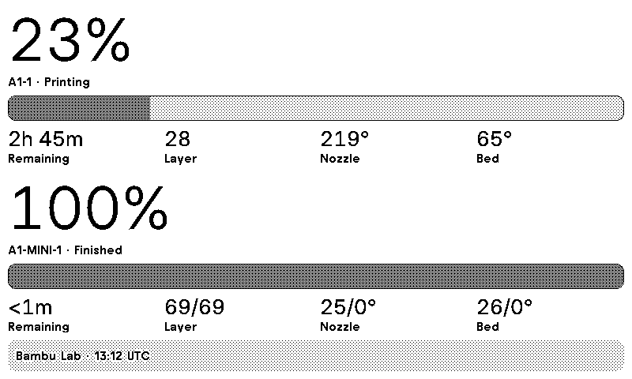
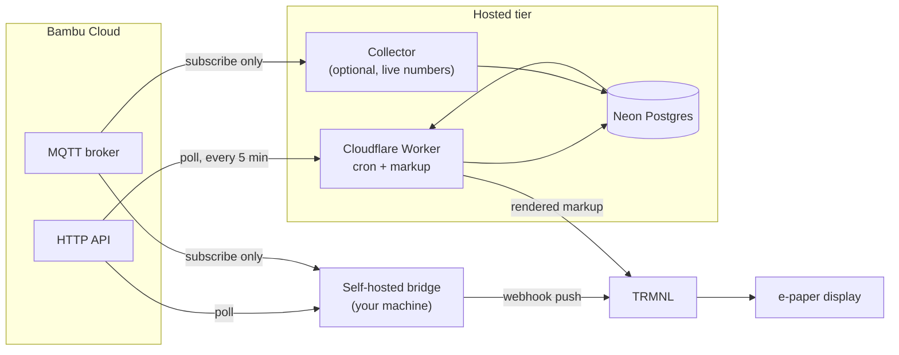
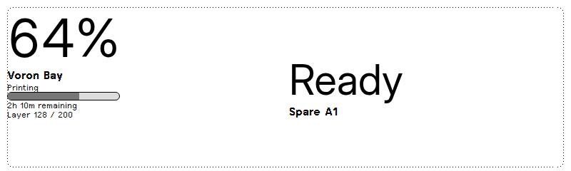
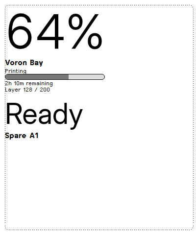
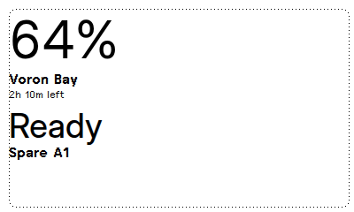
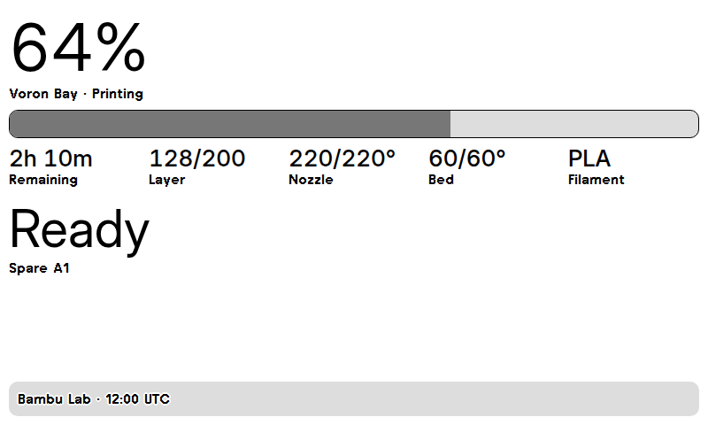

# trmnl-bambulab

[](https://github.com/moneycaringcoder/trmnl-bambulab/actions/workflows/ci.yml)
[](LICENSE)
[](https://usetrmnl.com)

See your Bambu Lab printers on a [TRMNL](https://usetrmnl.com) e-paper display.

Sign in with your Bambu account, pick which printers to show, and the display
tells you what they are doing. An idle printer shows its name and **Ready**. A
printing one shows progress, layer, time remaining, and temperatures.

Bambu Cloud only. **Read only** — this never sends a command to a printer, and
the MQTT client it uses is structurally unable to publish.



*An actual TRMNL render of the plugin — 1-bit, as the e-paper panel draws it.*

## Two ways to run it

**Hosted.** Marketplace installation is awaiting TRMNL review. Once it is
listed, install the plugin, enter the code Bambu emails you, and pick printers.
You install nothing and create no separate account. We never receive your
Bambu password; the resulting cloud token is encrypted before it reaches the
database.

**Self-hosted.** Run the bridge on your own machine. It talks directly to
Bambu Cloud and pushes a normalized snapshot to your own TRMNL webhook; our
hosted backend is never involved.

The two tiers do not always show the same amount, and the difference is not a
bug. Bambu's HTTP interface carries no progress, layer count, time remaining or
temperature; those arrive over MQTT, which wants a connection held open. The
self-hosted bridge holds one. The hosted tier holds one only while its
collector component is running, and degrades to name-and-state — never to a
blank screen — when it is not.



Nothing flows toward a printer on either path — both arrows out of Bambu
Cloud are reads.

| | Hosted | Self-hosted |
|---|---|---|
| You install | nothing | the bridge (Node 22.18+) |
| Sign-in | emailed Bambu code | email and password, or an existing token, on your machine |
| Progress, layers, time, temps | while the collector runs | always |
| Your Bambu token lives | encrypted in our database | on your machine |

## The four layouts

Every TRMNL viewport is supported, so the plugin works full-screen and in
mashups:

| | |
|---|---|
|  |  |
|  |  |

## Self-hosting

```sh
git clone https://github.com/moneycaringcoder/trmnl-bambulab
cd trmnl-bambulab
corepack enable
pnpm install --frozen-lockfile
pnpm --dir bridge setup
```

`pnpm --dir bridge setup` lets you paste an existing Bambu access token or sign
in with your email and password. A password is sent to Bambu Cloud once and
discarded; Bambu may then email you a verification code. The wizard lists the
printers on your account and asks which ones to show. You can finish without a
TRMNL webhook URL and add it later with `pnpm --dir bridge setup webhook`.
`pnpm --dir bridge start` then runs the bridge until you stop it.

| Command | Does |
|---|---|
| `pnpm --dir bridge setup` | Configure from scratch |
| `pnpm --dir bridge setup printers` | Change which printers show |
| `pnpm --dir bridge setup reauth` | Sign in again when the token expires |
| `pnpm --dir bridge setup webhook` | Set the TRMNL webhook URL |
| `pnpm --dir bridge start` | Run the bridge |

The password and any verification code are used only for their login requests
and never written to disk. Only the resulting access token is stored, in a file
the secret gate refuses to commit.

## Running your own hosted tier

Everything the hosted tier needs is in this repository: a Cloudflare Worker, a
Neon Postgres schema, and an optional collector container for live telemetry.
See the [hosted deployment guide](hosted/README.md), the
[collector operations guide](docs/COLLECTOR.md), and the
[TRMNL plugin contract](docs/TRMNL-PLUGIN.md).

## How it is built

| Path | What |
|---|---|
| `bridge/` | The self-hosted daemon, push scheduler, and setup CLI |
| `packages/core/` | Shared telemetry, subscribe-only MQTT, Bambu Cloud providers, payload building, encryption, stores, logging contracts, and screen serialization |
| `src/` | The display itself: shared markup and the four Liquid layouts. One design source for both tiers |
| `hosted/` | The hosted Cloudflare Worker, TRMNL marketplace protocol, Neon migrations, and server-side Liquid rendering |
| `collector/` | The always-on process that consumes the core package to hold Bambu MQTT for hosted accounts |
| `docs/` | The plugin contract, the collector guide, template documentation |
| `scripts/` | The secret scanner the pre-commit hook runs |

Bambu publishes no supported cloud API, so everything here is built on
reverse-engineered behaviour that can drift without notice. Where the display
could guess, it refuses instead — that is what the honesty rules below are.

## Honesty rules the display follows

- A metric that is absent is left blank, never shown as zero.
- A stale reading says it is old instead of posing as current.
- An unknown printer state is shown as unknown, not guessed into "idle".
- Job names can reveal what you are printing. The hosted tier never exports
  them; self-hosted export is opt-in and off by default.

## Contributing

Read [`CONTRIBUTING.md`](CONTRIBUTING.md). The one rule that matters most: no
printer serial, device id, account email, token, or webhook URL ever enters
this repository. A pre-commit hook enforces it, and the full history has been
swept. AI agents working here must follow [`AGENTS.md`](AGENTS.md).

Security policy and threat model: [`SECURITY.md`](SECURITY.md).

## License

MIT. See [`LICENSE`](LICENSE).

Bambu Lab publishes no supported public cloud API. Everything here is
reverse-engineered from community work and can break without notice. This
project is not affiliated with Bambu Lab or TRMNL.
